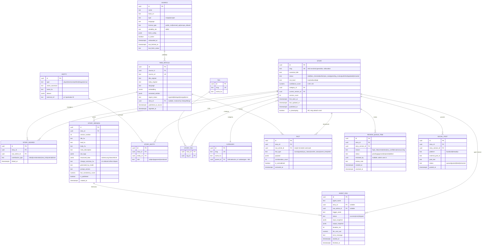
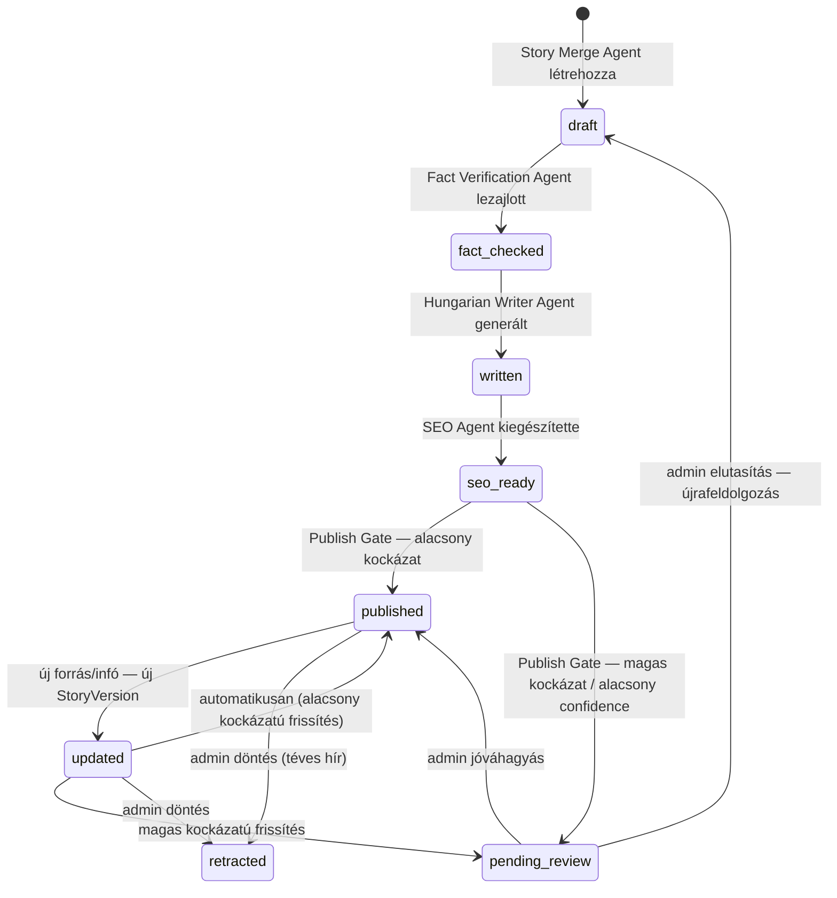

# 01 — Story-alapú adatmodell

[← vissza az áttekintéshez](./README.md)

## 1.1 Alapkoncepció

A hagyományos hírportál adatmodellje `Article`-központú: minden begyűjtött hír egy új sor egy `articles` táblában. Ez a modell **nem alkalmas** a kért viselkedésre ("ugyanazt a Story-t frissítse, ne hozzon létre új cikket"), mert nincs benne fogalom az "ugyanarról az eseményről szóló, időben bővülő tudás"-ra.

Ehelyett a rendszer középpontjában a **`Story`** áll:

- Egy **`Story`** egy valós, azonosítható sportesemény vagy hír-téma (pl. "Ferencváros–Real Madrid 2026.08.14. BL selejtező", "Szoboszlai Dominik térdsérülése — 2026.07", "X játékos igazolása Y klubhoz").
- Egy Story-hoz **N darab `RawArticle`** tartozhat (a nyers, begyűjtött forrás-cikkek).
- Egy Story-nak **N darab `StoryVersion`** verziója van — minden érdemi frissítés új verziót hoz létre, a `slug` és az azonosító változatlan marad.
- A publikált weboldal mindig a Story **aktuális (legutolsó, publikált) verzióját** mutatja, de a teljes verziótörténet lekérdezhető ("Frissítések" szekció a cikk alján).

## 1.2 Entitás-Reláció diagram



## 1.3 Story állapotgép



**Fontos tervezési döntés:** a `published` és `updated` állapotok **nem eltűnő, hanem visszatérő** ("published ⇄ updated") ciklust alkotnak — egy Story a teljes életciklusa alatt (akár napokig, egy fejlődő sztori esetén órákig) többször is átfuthat a `updated → (Publish Gate) → published` körön, minden körben új `StoryVersion`-t generálva.

## 1.4 Confidence Score — számítási modell

A `Story.confidence_score` (0.00–1.00) egy súlyozott összetett mutató, amit a **Fact Verification Agent** számol újra minden alkalommal, amikor a Story-hoz új forrás kapcsolódik vagy új tény kerül kinyerésre:

```
confidence_score =
      0.35 * source_corroboration_score   (hány független, megbízható forrás erősíti meg)
    + 0.25 * source_reliability_score     (a hozzájáruló források reliability_tier átlaga, súlyozva)
    + 0.25 * fact_consistency_score       (van-e ellentmondás a kinyert tények között)
    + 0.15 * recency_score                (mennyire friss / mennyire "élő" még a sztori)
```

- **source_corroboration_score**: 1 forrás → 0.3; 2 független forrás → 0.6; 3+ független forrás → 0.9-1.0. (Ugyanazon hírügynökségi tartalom több portálon **nem** számít független forrásnak — ezt az `Entity`+szövegfingerprint alapján a Dedup Agent jelöli.)
- **source_reliability_score**: `Source.reliability_tier` (A/B/C) numerikus leképezése, hozzájáruló források súlyozott átlaga.
- **fact_consistency_score**: a Fact Verification Agent NLI-alapú ellentmondás-keresésének eredménye (1.0 = nincs ellentmondás, csökken minden észlelt kontradikcióval).
- **recency_score**: friss, fejlődő sztoriknál (`is_developing = true`) alacsonyabb súlyt kap, amíg nem stabilizálódik.

A `confidence_score` **közvetlenül vezérli a Publish Gate döntést** (lásd [02-agents.md](./02-agents.md#publish-gate)).

## 1.5 Verziókövetés és frissítési előzmény

- Minden `StoryVersion` **immutábilis** — sosem módosul utólag, csak új verzió jön létre.
- A `Story.current_version_id` mindig a legutolsó **publikált** verzióra mutat (nem feltétlenül a legutolsó legenerált verzióra, ha az épp review-ban van).
- A publikus frontend a Story oldalán megjeleníti: "Frissítve: 2026.07.27 14:32 — *mit változott*" szekciót, ami a `StoryVersion.change_summary_hu` mezőből épül fel (ezt a Hungarian Writer Agent generálja minden frissítésnél: "mi az, ami új ehhez a korábbi verzióhoz képest").
- Az URL/`slug` **soha nem változik** verziófrissítéskor — ez SEO- és linkstabilitási követelmény.
