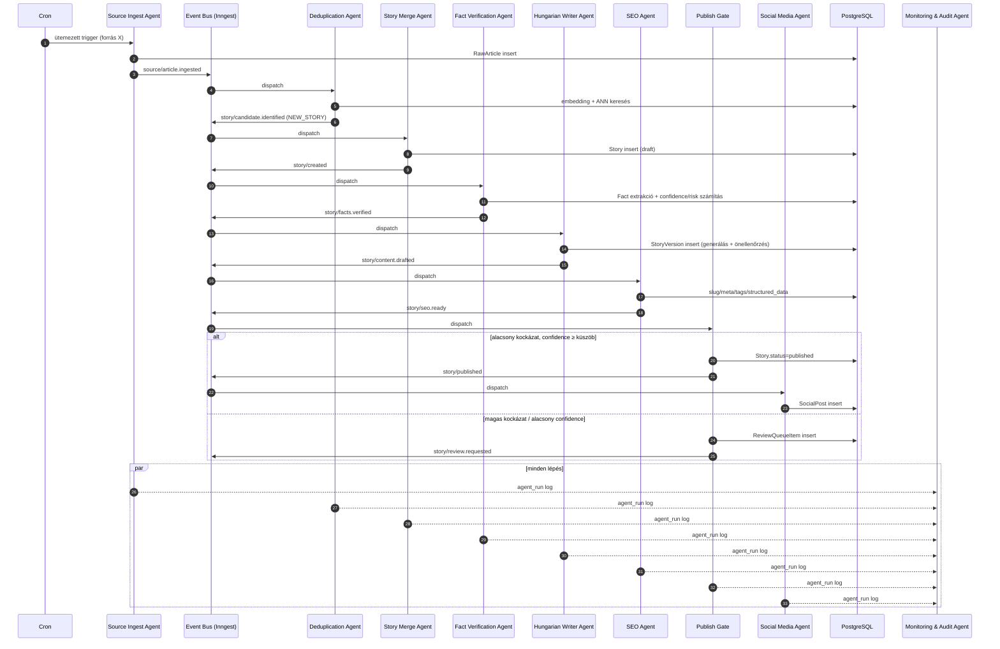
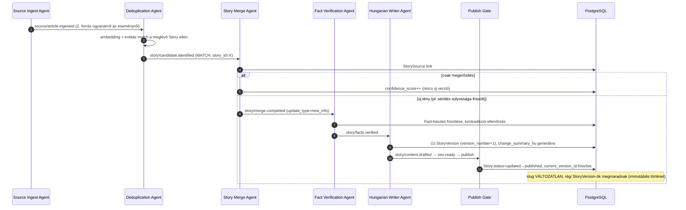

# 03 — Event-driven kommunikációs folyamat

[← vissza az áttekintéshez](./README.md)

## 3.1 Technológiai választás: queue/event bus

**Javaslat: [Inngest](https://www.inngest.com/)** (alternatíva: Trigger.dev) mint esemény-orchestrátor, **nem** nyers Redis/SQS.

**Indoklás:**
- Az agentek láncolatában több lépés is percekig tartó LLM-hívás-sorozat lehet (extrakció → generálás → önellenőrzés) — ez **meghaladja a Vercel serverless function timeout-ját** (10–60s a csomagtól függően, Fluid Compute-tal is korlátos). Inngest/Trigger.dev a lépéseket (`step.run`) külön-külön, saját timeout/retry-kezeléssel futtatja, a teljes láncot pedig durable workflow-ként kezeli — nem vész el állapot, ha egy lépés újrapróbálkozik.
- Beépített **retry, backoff, dead-letter, concurrency-limit forrásonként** (pl. "max 5 párhuzamos Fact Verification futás") — ezt nyers queue-ra saját kódban kellene megírni.
- Natívan illeszkedik Next.js/Vercel-hez: egyetlen `/api/inngest` route fogadja be az összes eseményt, a fejlesztői élmény (lokális dashboard, replay) gyors iterációt tesz lehetővé.
- **Skálázáskor** (300+ forrás) a concurrency-limitek és a per-esemény-típus throttling natívan támogatott, ami elengedhetetlen LLM API rate-limitek betartásához.

**Alternatíva, ha egyszerűbb indulás kell:** Postgres-alapú tábla-queue (pl. `pgmq` extension Supabase-en) + Vercel Cron, ha a csapat nem akar külső szolgáltatást bevezetni az MVP-hez. Ez a [08-roadmap.md](./08-roadmap.md) 0. fázisában megengedett, de a tervezett event-kontraktus (lásd lent) ugyanaz marad, így később súrlódásmentesen át lehet állni Inngest-re.

## 3.2 Esemény-katalógus

Minden esemény egy **típusos, verziózott JSON payload**, közös boríték mezőkkel:

```typescript
interface BaseEvent<T extends string, P> {
  id: string;              // esemény egyedi ID (idempotencia-kulcs)
  type: T;                 // pl. "story/facts.verified"
  version: 1;               // séma-verzió
  occurred_at: string;      // ISO timestamp
  correlation_id: string;   // egy Story életciklusán végigkövethető azonosító
  payload: P;
}
```

| Esemény típus | Kibocsátja | Feliratkozik | Payload (kulcsmezők) |
|---|---|---|---|
| `source/article.ingested` | Source Ingest Agent | Deduplication Agent | `raw_article_id`, `source_id` |
| `story/candidate.identified` | Deduplication Agent | Story Merge Agent | `raw_article_id`, `match_type`, `story_id?`, `candidates?` |
| `story/created` | Story Merge Agent | Fact Verification Agent | `story_id` |
| `story/merge.completed` | Story Merge Agent | Fact Verification Agent (ha `new_info`) | `story_id`, `update_type` |
| `story/facts.verified` | Fact Verification Agent | Hungarian Writer Agent | `story_id`, `confidence_score`, `risk_level`, `has_contradiction` |
| `story/content.drafted` | Hungarian Writer Agent | SEO Agent | `story_id`, `story_version_id`, `fact_consistency_score` |
| `story/seo.ready` | SEO Agent | Publish Gate | `story_id`, `story_version_id` |
| `story/published` | Publish Gate | Social Media Agent, frontend revalidate hook | `story_id`, `story_version_id` |
| `story/review.requested` | Publish Gate | Admin Review UI (értesítés) | `story_id`, `reason` |
| `story/review.resolved` | Admin API | Publish Gate (re-entry) | `story_id`, `decision: approved\|rejected` |
| `story/retracted` | Admin API | Social Media Agent, frontend | `story_id`, `reason` |
| `social/posted` | Social Media Agent | Monitoring & Audit Agent | `story_id`, `platform`, `external_post_id` |
| *(minden fenti)* | *(minden agent)* | **Monitoring & Audit Agent** (wildcard) | teljes esemény + `agent_run` metaadat |

## 3.3 Végponttól-végpontig szekvenciadiagram — új Story



## 3.4 Szekvenciadiagram — meglévő Story frissítése



## 3.5 Üzenet-séma példa (JSON Schema kivonat)

```json
{
  "type": "story/facts.verified",
  "version": 1,
  "payload": {
    "story_id": "uuid",
    "confidence_score": 0.78,
    "risk_level": "low",
    "has_contradiction": false,
    "fact_count": 6,
    "corroborating_source_count": 2
  }
}
```

## 3.6 Konzisztencia és idempotencia garanciák

- **At-least-once delivery** feltételezett (Inngest/Trigger.dev alapértelmezés) → minden agent DB-írása **upsert vagy unique constraint** védett (pl. `story_sources(story_id, raw_article_id)` unique).
- **Correlation ID** minden eseményen végigfut egy Story életciklusán, ami az `agent_runs` táblában egyetlen lekérdezéssel visszaadja a teljes feldolgozási láncot (debug/audit célra).
- **Konkurencia-limit Story szinten**: egy adott `story_id`-re csak egy Fact Verification / Writer futás mehet párhuzamosan (Inngest `concurrency: { key: event.data.story_id, limit: 1 }`), hogy két egyidejűleg beérkező frissítés ne írjon egymásra inkonzisztens verziót.
