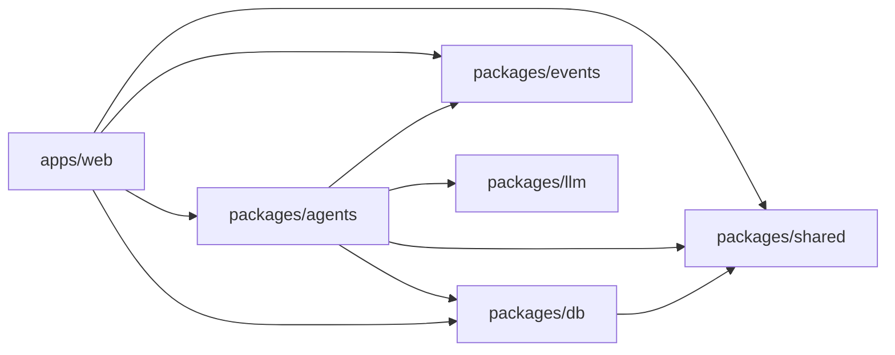

# 05 — GitHub repository struktúra

[← vissza az áttekintéshez](./README.md)

## 5.1 Monorepo, pnpm + Turborepo

A moduláris agent-architektúra (2.0 §) miatt monorepo javasolt: az agentek, a megosztott típusok/sémák és a frontend **egy repóban, de élesen elválasztott csomagokban** élnek — így egy agent önmagában tesztelhető és verziózható, miközben a típusbiztonság (event-sémák, DB-típusok) megosztott marad frontend és backend között.

```
magyarsportonline/
├── apps/
│   └── web/                          # Next.js alkalmazás (frontend + admin UI + API routes)
│       ├── app/
│       │   ├── (public)/             # publikus oldalak: /, /hir/[slug], /kategoria/[slug]
│       │   ├── admin/                # Admin Review UI (session-védett)
│       │   ├── api/
│       │   │   ├── v1/               # publikus API route handlerek
│       │   │   ├── admin/            # admin API route handlerek
│       │   │   ├── internal/cron/    # cron-trigger route handlerek
│       │   │   └── inngest/          # Inngest catch-all route
│       │   └── layout.tsx
│       ├── components/
│       ├── lib/                       # frontend-specifikus segédkód (nem agent-logika)
│       ├── middleware.ts              # admin auth guard
│       └── next.config.ts
│
├── packages/
│   ├── agents/                        # AI Agent implementációk — a rendszer szíve
│   │   ├── source-ingest/
│   │   │   ├── index.ts               # Inngest function definíció
│   │   │   ├── fetchers/              # rss.ts, api.ts, scraper.ts
│   │   │   └── source-ingest.test.ts
│   │   ├── deduplication/
│   │   │   ├── index.ts
│   │   │   ├── embedding.ts
│   │   │   ├── entity-match.ts
│   │   │   └── deduplication.test.ts
│   │   ├── story-merge/
│   │   │   ├── index.ts
│   │   │   └── story-merge.test.ts
│   │   ├── fact-verification/
│   │   │   ├── index.ts
│   │   │   ├── extraction.ts
│   │   │   ├── contradiction-check.ts
│   │   │   ├── confidence-score.ts
│   │   │   ├── risk-classifier.ts
│   │   │   └── fact-verification.test.ts
│   │   ├── hungarian-writer/
│   │   │   ├── index.ts
│   │   │   ├── prompts/               # verziózott prompt sablonok
│   │   │   ├── self-check.ts          # NLI/entailment ellenőrzés
│   │   │   └── hungarian-writer.test.ts
│   │   ├── seo/
│   │   │   ├── index.ts
│   │   │   ├── slug.ts
│   │   │   └── seo.test.ts
│   │   ├── publish-gate/
│   │   │   ├── index.ts               # determinisztikus szabály, nincs LLM
│   │   │   └── publish-gate.test.ts
│   │   ├── social-media/
│   │   │   ├── index.ts
│   │   │   ├── platforms/             # facebook.ts, threads.ts, x.ts
│   │   │   └── social-media.test.ts
│   │   └── monitoring-audit/
│   │       ├── index.ts
│   │       ├── anomaly-detection.ts
│   │       └── monitoring-audit.test.ts
│   │
│   ├── events/                        # esemény-katalógus, típusdefiníciók + Zod sémák
│   │   └── src/
│   │       ├── schemas/               # story.events.ts, source.events.ts, social.events.ts
│   │       └── inngest-client.ts      # megosztott Inngest kliens
│   │
│   ├── db/                            # adatbázis-réteg
│   │   ├── prisma/schema.prisma       # (vagy drizzle/schema.ts, lásd megjegyzés)
│   │   ├── migrations/
│   │   ├── seed/
│   │   └── src/repositories/          # StoryRepository, SourceRepository, stb. — tiszta DB-hozzáférés, agentek ezen keresztül írnak/olvasnak
│   │
│   ├── llm/                           # LLM-kliens absztrakció (Anthropic SDK wrapper)
│   │   └── src/
│   │       ├── client.ts
│   │       ├── model-router.ts        # modell-tiering (olcsó extrakció vs. erős generálás)
│   │       └── cost-tracker.ts
│   │
│   ├── shared/                        # megosztott TS típusok, konstansok, util
│   │
│   └── config/                        # shared eslint/tsconfig/prettier presetek
│
├── infra/
│   ├── vercel/                        # vercel.json, cron konfig
│   └── scripts/                       # onboarding script új forráshoz, dry-run eszközök
│
├── docs/
│   ├── feasibility-analysis.md
│   └── architecture/                  # ez a dokumentumsorozat
│
├── .github/
│   └── workflows/
│       ├── ci.yml                     # lint, typecheck, unit tesztek minden PR-en
│       ├── db-migration-check.yml     # migrációk dry-run ellenőrzése
│       └── deploy-preview.yml         # Vercel preview deploy PR-enként (ha nem a natív Vercel GitHub App fut)
│
├── turbo.json
├── pnpm-workspace.yaml
├── package.json
└── README.md
```

## 5.2 Csomag-függőségi szabályok



**Kritikus szabály:** `packages/agents` **soha nem** importál semmit `apps/web`-ből — az agentek önállóan, a webalkalmazástól függetlenül tesztelhetők és (később, ha szükséges) akár külön szolgáltatásba is kiszervezhetők anélkül, hogy a frontendet érintené.

## 5.3 Adatbázis-réteg technológiai megjegyzés

**Javaslat: Drizzle ORM** Prisma helyett ebben a projektben, mert:
- natívan jól kezeli a `pgvector` típust (embedding oszlopok) migrációkban,
- edge/serverless környezetben (Vercel) gyorsabb hidegindítás, mint a Prisma engine,
- SQL-hez közeli, explicit query-építés — fontos, mert az agent-lánc teljesítmény- és költségkritikus, nem szabad "rejtett" N+1 lekérdezéseket engedni.

Prisma is működne, ha a csapat ismertsége/gyorsasága fontosabb szempont — ez implementációs döntés, nem architekturális korlát.

## 5.4 Branch- és release-stratégia

- `main` — mindig deploy-olható, védett branch, csak PR + CI zöld + review után mergelhető.
- Feature branch-ek: `feature/<agent-név>-<rövid-leírás>` vagy `claude/<feladat-azonosító>` (AI-asszisztált fejlesztéshez).
- **Agent-csomagonkénti verziózás nem szükséges** (monorepo, egy deploy egység), de minden agent `index.ts`-ében kötelező egy `AGENT_VERSION` konstans, ami bekerül az `agent_runs.prompt_version`/metaadatba — ez teszi visszakereshetővé, hogy melyik kódverzió generálta az adott `StoryVersion`-t.
