# 06 — Vercel deployment terv

[← vissza az áttekintéshez](./README.md)

## 6.1 Komponensek elhelyezése

| Komponens | Hol fut | Miért |
|---|---|---|
| Next.js frontend (publikus + admin UI) | **Vercel** (Next.js App Router, ISR) | natív illeszkedés, edge cache, gyors globális kiszolgálás |
| API route handlerek (`/api/v1`, `/api/admin`) | **Vercel Serverless/Edge Functions** | rövid életű kérések, jól illeszkedik a timeout-korlátokhoz |
| Inngest agent-orchestráció | **Inngest Cloud** (a `/api/inngest` route-on keresztül hívja vissza a Vercel-en futó agent-kódot) | a hosszú, több-lépéses agent-láncok Inngest oldalon vannak orchestrálva (durable state), a tényleges lépés-végrehajtás a Vercel function-ben történik — így a Vercel timeout csak egy-egy lépésre vonatkozik, nem a teljes láncra |
| PostgreSQL | **Supabase** (javasolt MVP-hez) vagy **Neon** (javasolt, ha tiszta serverless Postgres + branch-alapú preview DB kell) | lásd döntési szempontok lent |
| Cron ütemezés | **Vercel Cron** → Inngest esemény kibocsátás | egyszerű, natív Vercel-integráció |
| Kép/média tárolás (social kártyák, OG image) | **Vercel Blob** vagy Supabase Storage | egyszerű, CDN-mögötti tárolás |
| Megfigyelés/riasztás | Vercel Log Drains + Inngest dashboard + Slack webhook | lásd [02-agents.md §2.9](./02-agents.md#29--monitoring--audit-agent) |

## 6.2 Supabase vs. Neon — döntési szempontok

| Szempont | Supabase | Neon |
|---|---|---|
| pgvector | ✅ natív | ✅ natív |
| Beépített auth (Admin UI login) | ✅ (de NextAuth is jó választás egyik felett is) | ❌ (NextAuth/Clerk szükséges) |
| Branch-alapú preview DB (PR-enként izolált DB) | korlátozott | ✅ elsőrangú funkció (Neon branching) |
| Serverless skálázás/cold start | jó | kiváló (true serverless, autosuspend) |
| Realtime subscription (pl. élő review-queue frissítés admin UI-ban) | ✅ natív | ❌ (polling vagy külön realtime réteg kell) |

**Javaslat:** **Neon**, ha a PR-onkénti izolált adatbázis-branch (gyors, biztonságos migráció-tesztelés CI-ban) és a tiszta serverless skálázás a prioritás — ez illik jobban az agent-fejlesztés iterációs sebességéhez. **Supabase**, ha az Admin Review UI élő (realtime) frissítése és a beépített auth gyorsabb indulást ad. Mivel a review-queue élő frissítése "nice-to-have" (5-10 mp-es polling is elfogadható helyette), **Neon-t javaslok elsődlegesen**, NextAuth-szal az admin authhoz.

## 6.3 Környezetek

```mermaid
flowchart LR
    subgraph DEV["Fejlesztői (lokális)"]
        D1["pnpm dev — Next.js"]
        D2["Neon dev branch / lokális Postgres"]
        D3["Inngest Dev Server (lokális)"]
    end
    subgraph PREVIEW["Preview (minden PR)"]
        P1["Vercel Preview Deployment"]
        P2["Neon DB branch (PR-specifikus, automatikusan törlődik merge után)"]
        P3["Inngest branch environment"]
        P4["Csak teszt-forrásokra korlátozott ingest (nem él forrás)"]
    end
    subgraph STAGING["Staging"]
        S1["Vercel staging domain"]
        S2["Neon staging branch"]
        S3["Éles forrás-mix, DE publikálás review-only módban"]
    end
    subgraph PROD["Production"]
        PR1["Vercel production — magyarsportonline.hu"]
        PR2["Neon production"]
        PR3["Teljes agent-pipeline, valós Publish Gate küszöbökkel"]
    end
    DEV -->|PR nyitás| PREVIEW
    PREVIEW -->|merge main-be| STAGING
    STAGING -->|manuális promote| PROD
```



- **Preview környezetben** az ingest agent **csak whitelistelt teszt-forrásokra** fut (env var: `ALLOWED_SOURCES=test-only`), hogy PR tesztelés közben ne generáljunk éles, publikálható tartalmat vagy ne terheljük feleslegesen a valódi forrásokat/LLM-kvótát.
- **Staging**: éles forrás-adatfolyam fut, de a Publish Gate `FORCE_REVIEW_MODE=true` env-vel minden Story-t review-queue-ba kényszerít — így új agent-verzió minőségét emberi szem ellenőrzi, mielőtt production-be kerülne.
- **Production**: teljes automatizált pipeline, a [08-roadmap.md](./08-roadmap.md)-ban leírt fokozatos küszöb-lazítással.

## 6.4 CI/CD folyamat

1. PR nyitás → GitHub Actions: lint (`eslint`), típusellenőrzés (`tsc --noEmit`), unit tesztek (agentenként, mockolt LLM-kliens), DB migráció dry-run Neon preview branch ellen.
2. Vercel GitHub App automatikusan preview deployment-et készít a PR-hoz (natív integráció, nem kell külön workflow).
3. Merge `main`-be → automatikus staging deploy + migráció futtatás staging DB-n.
4. Manuális "Promote to Production" (Vercel dashboard vagy `vercel promote` CLI) — **szándékosan nem automatikus**, mert ez az egyetlen pont, ahol egy ember tudatosan dönt "ez a kódverzió mehet élesre" — ez nem a *tartalom* publikálási döntése (az agent-pipeline felelőssége), hanem a *szoftver* release döntése.

## 6.5 Cron-konfiguráció (`vercel.json` vázlat)

```json
{
  "crons": [
    { "path": "/api/internal/cron/dispatch-ingest", "schedule": "*/2 * * * *" },
    { "path": "/api/internal/cron/health-check", "schedule": "*/10 * * * *" },
    { "path": "/api/internal/cron/review-queue-sla-check", "schedule": "0 * * * *" }
  ]
}
```

- `dispatch-ingest`: 2 percenként lefut, kiválasztja, mely aktív forrásokat kell épp lekérdezni (a `Source.reliability_tier`/utolsó fetch alapján), és Inngest eseményt bocsát ki forrásonként — így maga a Source Ingest Agent nem cron-onként egy forrás, hanem eseményvezérelt, ami könnyebben skálázik 300+ forrásra (lásd [07-scalability.md](./07-scalability.md)).
- `review-queue-sla-check`: ha egy review-elem túl régóta vár (pl. > 2 óra), Monitoring riasztást küld — a review-queue nem válhat "néma" szűk keresztmetszetté.

## 6.6 Titkok és környezeti változók kezelése

- Minden API-kulcs (Anthropic, Meta Graph API, X API, Inngest signing key, DB connection string) **Vercel Environment Variables**-ben, környezetenként (Preview/Staging/Production) elkülönítve.
- Preview környezetben **külön, korlátozott jogosultságú** API-kulcsok (pl. alacsonyabb LLM-kvóta, teszt social media appok), hogy egy PR-ban futó kód sose tudjon éles közösségi posztot kiküldeni.

---

## 6.7 Deployment-felület izolációja (review-kiegészítés)

A [09-architecture-review.md §3](./09-architecture-review.md#3-single-point-of-failure-spof-leltár) rámutatott, hogy a `/api/inngest` catch-all route és a publikus frontend **ugyanabban a Vercel deploymentben** él — egy hibás agent-kód deploy elméletileg egyszerre veszélyeztetheti a publikus oldal elérhetőségét is. Mivel a monorepo/egy-deployment modell egyébként jelentős fejlesztési sebességet ad (lásd [05-repo-structure.md](./05-repo-structure.md)), **nem javasolt külön szolgáltatásba szétválasztani** ezen a skálán — ehelyett a kockázatot deploy-folyamattal kezeljük:
- **Kötelező canary/staged rollout**: minden production deploy előbb staging környezetben fut (lásd 6.3), és a production promote csak explicit, manuális jóváhagyással történik (már tervezve, 6.4).
- **Gyors rollback**: Vercel egy paranccsal visszaállítja az előző working deploymentet — ezt a folyamatot dokumentálni és időnként gyakorolni kell (lásd 6.9, DR-próbák).
- **Health-check a `/api/inngest` route-on**: minden deploy után automatikus smoke-test ellenőrzi, hogy a route fogad és helyesen dolgoz fel egy szintetikus eseményt, mielőtt a deploy "sikeresnek" minősülne.

## 6.8 Observability stack (review-kiegészítés)

A [09-architecture-review.md §10](./09-architecture-review.md#10-monitoring-tracing-observability-audit--production-követelmények) alapján a Monitoring & Audit Agent önmagában (Postgres `agent_runs` + Slack riasztás) nem elég 24/7 production üzemhez. Kiegészítő rétegek:

| Réteg | Eszköz (javaslat) | Cél |
|---|---|---|
| Strukturált logolás | Axiom / Better Stack (vagy Datadog) | minden agent-futás nyers naplója **nem** a Postgres `agent_runs`-ban él (lásd [09-architecture-review.md §6](./09-architecture-review.md#6-gyorsan-növekvő-táblák-particionálás-archiválás)), hanem itt — magas kardinalitású keresés, retention-szabályozás |
| Elosztott tracing | OpenTelemetry export → Honeycomb / Grafana Tempo / Axiom | egy Story teljes útja mind a 8 agentesen keresztül egyetlen trace-waterfall-ban, a `correlation_id`/`trace_id` mentén ([03-event-flow.md §3.8](./03-event-flow.md#38-tracing-és-observability-review-kiegészítés)) |
| Metrikák/dashboard | Grafana (vagy a fenti eszközök beépített dashboardja) | ingest lag, pipeline-latencia forrástól publikálásig, auto-publish vs. review arány, LLM-költség/Story, confidence-eloszlás, kontradikció-arány, dedup precízió/recall (mintavételezett), review-queue kora, forrás-egészség, API p95/p99, DB connection pool telítettség, queue backlog |
| SLO-alapú riasztás | Monitoring & Audit Agent + a fenti dashboard | explicit célértékek, pl.: alacsony kockázatú Story-k 95%-a 5 percen belül publikálódjon; review-queue elem max 4 órán belül megoldódjon; ingest hibaarány < 1% — riasztás **SLO-sértésre**, nem csak nyers hibaarányra |
| Synthetic monitoring ("kanári forrás") | ütemezett Inngest job | egy szintetikus teszt-forrás rendszeresen (pl. 5 percenként) végigfuttat egy ismert tartalmat a teljes pipeline-on, és méri, hogy elvárt időn belül tényleg megjelenik-e Story formájában — **ez az egyetlen módszer, ami a `dispatch-ingest` cron néma leállását ténylegesen kiszúrja**, mert egy 0-throughput állapot 0 hibát termel |
| Cost circuit breaker | Monitoring & Audit Agent | napi LLM-költség konfigurált küszöb felett a kill-switch **automatikusan** aktiválódik, nem csak manuálisan indítható (lásd [02-agents.md §2.9](./02-agents.md#29--monitoring--audit-agent)) |

## 6.9 Backup és Disaster Recovery (review-kiegészítés)

A [09-architecture-review.md §11](./09-architecture-review.md#11-backup-és-disaster-recovery) alapján, mert ez teljes egészében hiányzott az eredeti tervből:

- **PITR (Point-in-Time Recovery)** bekapcsolása Neon/Supabase-en, célértékekkel: **RPO ≤ 5 perc, RTO ≤ 1 óra**.
- **Negyedéves helyreállítási próba**: tényleges visszaállítás tesztkörnyezetbe, nem csak "van backup" feltételezés.
- **Queue mint másodlagos helyreállítási forrás**: az Inngest durable, korlátozott ideig visszajátszható eseménynaplója lehetővé teszi, hogy egy DB-visszaállítás után a visszaállítási pont utáni eseményeket újrajátsszuk — ezt tudatosan kihasznált tervezési tulajdonságként dokumentáljuk, nem csak mellékhatásként.
- **Konfiguráció/secrets helyreállítás**: dokumentált folyamat a Vercel env változók, Inngest signing key, API-kulcsok újralétrehozására egy vadonatúj környezetben.
- **Egyrégiós DB elfogadott kockázat**: magyar közönségű oldalnál multi-region write-primary nem indokolt — tudatos, dokumentált döntés, nem hallgatólagos hiányosság.

## 6.10 24/7 stabilitás — staleness kezelés (review-kiegészítés)

A [09-architecture-review.md §12](./09-architecture-review.md#12-247-stabilitás) alapján: LLM-szolgáltatói kiesésnél a queue natívan visszatartja/újrapróbálja az eseményeket, de ez önmagában nem elég élő, gyorsan változó (`is_developing=true`) Story-knál — ha egy ilyen Story feldolgozása egy küszöbnél (pl. 15 perc) tovább késik, automatikusan `pending_review`-ba kerül publikálás helyett ahelyett, hogy elavult "élő" tartalom jelenne meg frissként. On-call/eszkalációs terv: **P1** (hibás tartalom él, vagy kill-switch aktiválódott) → azonnali riasztás; **P2** (ingest leállt) → 1 órán belüli; **P3** (költség-anomália) → napi összesítő — a felelős szerkesztő (jogi kötelezettség, [feasibility-analysis.md §9](../feasibility-analysis.md)) az elsődleges címzett.
