# 06 — Vercel deployment terv

[← vissza az áttekintéshez](./README.md)

## 6.1 Komponensek elhelyezése

| Komponens | Hol fut | Miért |
|---|---|---|
| Next.js frontend (publikus + admin UI) | **Vercel** (Next.js App Router, ISR) | natív illeszkedés, edge cache, gyors globális kiszolgálás |
| API route handlerek (`/api/v1`, `/api/admin`) | **Vercel Serverless/Edge Functions** | rövid életű kérések, jól illeszkedik a timeout-korlátokhoz |
| Inngest agent-orchestráció | **Inngest Cloud** (a `/api/inngest` route-on keresztül hívja vissza a Vercel-en futó agent-kódot) | a hosszú, több-lépéses agent-láncok Inngest oldalon vannak orchestrálva (durable state), a tényleges lépés-végrehajtás a Vercel function-ben történik — így a Vercel timeout csak egy-egy lépésre vonatkozik, nem a teljes láncra |
| PostgreSQL | **Supabase** (javasolt MVP-hez) vagy **Neon** (javasolt, ha tiszta serverless Postgres + branch-alapú preview DB kell) | lásd döntési szempontok lent |
| Cron ütemezés | **Vercel Cron** → Inngest esemény kibocsátás | egyszerű, natív Vercel-integráció |
| Kép/média tárolás (social kártyák, OG image) | **Vercel Blob** vagy Supabase Storage | egyszerű, CDN-mögötti tárolás |
| Megfigyelés/riasztás | Vercel Log Drains + Inngest dashboard + Slack webhook | lásd [02-agents.md §2.9](./02-agents.md#29--monitoring--audit-agent) |

## 6.2 Supabase vs. Neon — döntési szempontok

| Szempont | Supabase | Neon |
|---|---|---|
| pgvector | ✅ natív | ✅ natív |
| Beépített auth (Admin UI login) | ✅ (de NextAuth is jó választás egyik felett is) | ❌ (NextAuth/Clerk szükséges) |
| Branch-alapú preview DB (PR-enként izolált DB) | korlátozott | ✅ elsőrangú funkció (Neon branching) |
| Serverless skálázás/cold start | jó | kiváló (true serverless, autosuspend) |
| Realtime subscription (pl. élő review-queue frissítés admin UI-ban) | ✅ natív | ❌ (polling vagy külön realtime réteg kell) |

**Javaslat:** **Neon**, ha a PR-onkénti izolált adatbázis-branch (gyors, biztonságos migráció-tesztelés CI-ban) és a tiszta serverless skálázás a prioritás — ez illik jobban az agent-fejlesztés iterációs sebességéhez. **Supabase**, ha az Admin Review UI élő (realtime) frissítése és a beépített auth gyorsabb indulást ad. Mivel a review-queue élő frissítése "nice-to-have" (5-10 mp-es polling is elfogadható helyette), **Neon-t javaslok elsődlegesen**, NextAuth-szal az admin authhoz.

## 6.3 Környezetek

```mermaid
flowchart LR
    subgraph DEV["Fejlesztői (lokális)"]
        D1["pnpm dev — Next.js"]
        D2["Neon dev branch / lokális Postgres"]
        D3["Inngest Dev Server (lokális)"]
    end
    subgraph PREVIEW["Preview (minden PR)"]
        P1["Vercel Preview Deployment"]
        P2["Neon DB branch (PR-specifikus, automatikusan törlődik merge után)"]
        P3["Inngest branch environment"]
        P4["Csak teszt-forrásokra korlátozott ingest (nem él forrás)"]
    end
    subgraph STAGING["Staging"]
        S1["Vercel staging domain"]
        S2["Neon staging branch"]
        S3["Éles forrás-mix, DE publikálás review-only módban"]
    end
    subgraph PROD["Production"]
        PR1["Vercel production — magyarsportonline.hu"]
        PR2["Neon production"]
        PR3["Teljes agent-pipeline, valós Publish Gate küszöbökkel"]
    end
    DEV -->|PR nyitás| PREVIEW
    PREVIEW -->|merge main-be| STAGING
    STAGING -->|manuális promote| PROD
```



- **Preview környezetben** az ingest agent **csak whitelistelt teszt-forrásokra** fut (env var: `ALLOWED_SOURCES=test-only`), hogy PR tesztelés közben ne generáljunk éles, publikálható tartalmat vagy ne terheljük feleslegesen a valódi forrásokat/LLM-kvótát.
- **Staging**: éles forrás-adatfolyam fut, de a Publish Gate `FORCE_REVIEW_MODE=true` env-vel minden Story-t review-queue-ba kényszerít — így új agent-verzió minőségét emberi szem ellenőrzi, mielőtt production-be kerülne.
- **Production**: teljes automatizált pipeline, a [08-roadmap.md](./08-roadmap.md)-ban leírt fokozatos küszöb-lazítással.

## 6.4 CI/CD folyamat

1. PR nyitás → GitHub Actions: lint (`eslint`), típusellenőrzés (`tsc --noEmit`), unit tesztek (agentenként, mockolt LLM-kliens), DB migráció dry-run Neon preview branch ellen.
2. Vercel GitHub App automatikusan preview deployment-et készít a PR-hoz (natív integráció, nem kell külön workflow).
3. Merge `main`-be → automatikus staging deploy + migráció futtatás staging DB-n.
4. Manuális "Promote to Production" (Vercel dashboard vagy `vercel promote` CLI) — **szándékosan nem automatikus**, mert ez az egyetlen pont, ahol egy ember tudatosan dönt "ez a kódverzió mehet élesre" — ez nem a *tartalom* publikálási döntése (az agent-pipeline felelőssége), hanem a *szoftver* release döntése.

## 6.5 Cron-konfiguráció (`vercel.json` vázlat)

```json
{
  "crons": [
    { "path": "/api/internal/cron/dispatch-ingest", "schedule": "*/2 * * * *" },
    { "path": "/api/internal/cron/health-check", "schedule": "*/10 * * * *" },
    { "path": "/api/internal/cron/review-queue-sla-check", "schedule": "0 * * * *" }
  ]
}
```

- `dispatch-ingest`: 2 percenként lefut, kiválasztja, mely aktív forrásokat kell épp lekérdezni (a `Source.reliability_tier`/utolsó fetch alapján), és Inngest eseményt bocsát ki forrásonként — így maga a Source Ingest Agent nem cron-onként egy forrás, hanem eseményvezérelt, ami könnyebben skálázik 300+ forrásra (lásd [07-scalability.md](./07-scalability.md)).
- `review-queue-sla-check`: ha egy review-elem túl régóta vár (pl. > 2 óra), Monitoring riasztást küld — a review-queue nem válhat "néma" szűk keresztmetszetté.

## 6.6 Titkok és környezeti változók kezelése

- Minden API-kulcs (Anthropic, Meta Graph API, X API, Inngest signing key, DB connection string) **Vercel Environment Variables**-ben, környezetenként (Preview/Staging/Production) elkülönítve.
- Preview környezetben **külön, korlátozott jogosultságú** API-kulcsok (pl. alacsonyabb LLM-kvóta, teszt social media appok), hogy egy PR-ban futó kód sose tudjon éles közösségi posztot kiküldeni.
