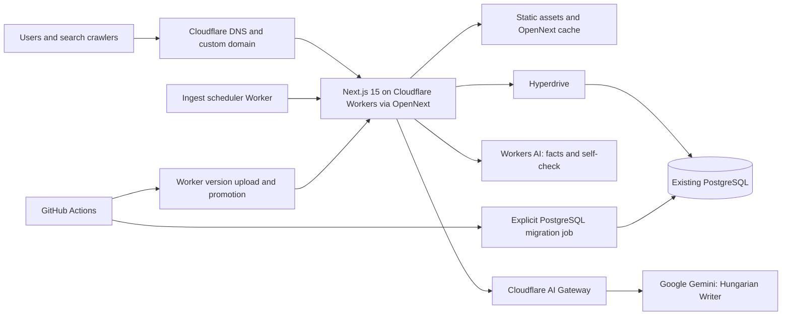

# 10 — Cloudflare Workers migration plan

**Status:** In progress — DNS cutover submitted; registrar propagation pending
**Prepared:** 2026-09-12
**Scope decision:** Move the Next.js application and scheduled execution from Vercel to Cloudflare Workers. Keep the existing PostgreSQL database and PostgreSQL schema in place. D1 is a later, separately approved migration.

## 10.1 Decision summary

The migration should be split at the platform boundary:

1. Deploy the existing Next.js 15 application to Cloudflare Workers through the OpenNext adapter.
2. Connect each Worker environment to its existing PostgreSQL environment through Cloudflare Hyperdrive.
3. Keep the current PostgreSQL Drizzle schema, migrations, transactions, advisory locks, `pgvector`, and data unchanged.
4. Run Vercel and Cloudflare in parallel until the Cloudflare deployment passes the production smoke and pipeline checks.
5. Move the scheduler target and public domain to Cloudflare, with Vercel retained as the immediate rollback target.
6. Reassess D1 only after the Worker deployment has at least 30 days of production measurements.

OpenNext is the initial adapter because the application started this migration on Next.js 15.1.12. OpenNext 1.20.6 required the compatible Next.js 15.5.24 patch line, which is now pinned. Cloudflare's vinext migration path remains a separate future framework decision.

### Implementation checkpoint — 2026-09-12

- OpenNext 1.20.6 and Wrangler 4.127.1 are configured on Node.js 22 with Next.js 15.5.24.
- The Worker bundle builds successfully. A temporary deployment at <https://magyarsportonline-web.mealdealhu.workers.dev> verified OpenNext packaging in a separate Cloudflare account; it is not the cutover target.
- The production Worker is deployed in the account that already hosts the scheduler at <https://magyarsportonline-web.footballinvestmentkft.workers.dev>. Both `/` and `/impresszum` return HTTP 200.
- The authoritative database is the Neon `magyarsportonline` project (`wild-lake-68761162`), writable production branch `clean-prod-20260829` (`br-broad-mountain-a2de1tqm`), database `neondb`, in AWS Europe Central 1 (Frankfurt). The default `production` branch is read-only and is not used by the Worker.
- The `magyarsportonline-postgres` production Hyperdrive configuration points at the writable production branch, and binding ID `3a2967f028b449f7ade610395f6ccfbe` is configured as `HYPERDRIVE`.
- `magyarsportonline-ingest-scheduler` targets the production Worker URL, has the same rotated `CRON_SECRET`, and runs every minute. Authenticated smoke tests for `/api/internal/cron/dispatch-ingest` and `/api/internal/jobs/process` both return HTTP 200.
- GitHub's `Production` environment contains the Cloudflare account ID, deployment token, shared cron secret, and writable Neon production URL used by the deployment workflow.
- The `magyarsportonline.hu` zone and both Worker custom domains are configured in Cloudflare. On 2026-09-12 Rackhost accepted the nameserver change to `ethan.ns.cloudflare.com` and `tori.ns.cloudflare.com`; public DNS can continue returning the former DNS24 nameservers and parking page during registrar propagation (Rackhost states up to 24 hours).
- R2 is not enabled for the Cloudflare account. The homepage is therefore request-rendered; R2 incremental caching remains an optional follow-up.
- Production AI is configured as Workers AI for fact extraction/self-check and Gemini `gemini-3.5-flash-lite` for the Final Hungarian Writer. Gemini traffic goes through the authenticated `magyarsportonline` Cloudflare AI Gateway.

## 10.2 Current-state findings

| Area | Current implementation | Migration implication |
|---|---|---|
| Web/runtime | Next.js 15.5 App Router packaged with OpenNext | Preserve Next.js behavior during the first cutover and keep the adapter upgrade separate from later framework changes. |
| Dynamic features | Route handlers, React Server Components, server actions, middleware, ISR/revalidation | Include each in the Worker-runtime acceptance suite. Configure OpenNext incremental caching rather than assuming Vercel cache behavior carries over. |
| Database | Drizzle ORM + Postgres.js + PostgreSQL | Keep schema and repositories. Route Worker database traffic through Hyperdrive. |
| DB connection lifecycle | One module-global Postgres/Drizzle client | Refactor to a request-scoped client. Cloudflare Workers must not reuse a database connection across requests. |
| DB-specific behavior | 26 tables, 28 PostgreSQL enum declarations, 25 SQL migrations, `jsonb`, arrays, UUID defaults, timezone timestamps, `pgvector`, advisory locks, transactions, and `FOR UPDATE SKIP LOCKED` | Strong reason to defer D1. None of this needs to change for the Worker migration. |
| Async pipeline | PostgreSQL-backed `pipeline_jobs`, drained by `/api/internal/jobs/process` | Keep the queue implementation for parity. Measure it on Workers before considering Cloudflare Queues or Workflows. |
| Scheduling | Existing Cloudflare scheduled Worker calls a hard-coded Vercel origin every minute; Vercel also has a daily cron | Parameterize the target origin and ensure only one production scheduler is active at cutover. |
| AI | Fact extraction/self-check use Workers AI; the Hungarian Writer uses Gemini | Keep the split and route Gemini through an authenticated Cloudflare AI Gateway. A native Workers AI binding remains a later optimization. |
| Build | `apps/web` runs PostgreSQL migrations inside `build` | Separate migration from application build before enabling Cloudflare deployments. Builds must be repeatable and free of production DB writes. |
| Vercel coupling | Hard-coded Vercel URLs, `VERCEL_*` diagnostics, workflow defaults, comments, and docs | Change runtime-critical references before cutover; clean documentation and historical comments after stabilization. |

## 10.3 Target architecture



Environment isolation remains the same:

| Environment | Worker | Hyperdrive target | Content safety |
|---|---|---|---|
| Local | Wrangler/OpenNext preview | Local or development PostgreSQL | `LLM_PROVIDER=none` allowed |
| Preview | Per-PR Worker preview/version | Preview PostgreSQL branch/database | Test sources only; no production scheduler |
| Staging | Stable staging Worker/domain | Staging PostgreSQL | `FORCE_REVIEW_MODE=true` |
| Production | Custom-domain Worker | Production PostgreSQL | Current production policy |

## 10.4 Migration phases

### Phase 0 — Baseline and guardrails (0.5–1 day)

Tasks:

- Record current production status, latency, error rate, and output for `/`, story pages, category/team pages, `/api/v1/stories`, RSS, sitemap, robots, admin login, and authenticated admin actions.
- Record pipeline queue counts and run one controlled `dispatch-ingest` plus `jobs/process` cycle.
- Inventory production, staging, and preview secrets without copying secret values into the repository.
- Confirm whether `magyarsportonline.hu` DNS is already hosted by Cloudflare. If not, onboard the zone before the production cutover and reduce relevant DNS TTLs at least 24 hours in advance.
- Declare a schema freeze for the final staging soak and production cutover window.

Exit criteria:

- A repeatable smoke script and baseline report exist.
- The Vercel production deployment and current scheduler configuration are recorded as rollback targets.
- Environment owners and cutover operator are identified.

### Phase 1 — Worker compatibility build (1–2 days)

Tasks:

- Add `@opennextjs/cloudflare` and a current Wrangler 4 release to `apps/web`.
- Add `apps/web/wrangler.jsonc`, `apps/web/open-next.config.ts`, generated Cloudflare binding types, and scripts for Worker build, local preview, version upload, and deployment.
- Enable the documented Node.js compatibility mode and configure `.open-next/worker.js` plus `.open-next/assets`.
- Add `.open-next` and Wrangler-generated output to `.gitignore`.
- Keep `next dev` available, and add an OpenNext preview command so both the Node development path and `workerd` runtime can be tested.
- Configure static asset caching. Configure an R2-backed OpenNext incremental cache if ISR and `revalidatePath` parity cannot be demonstrated without it.
- Run `wrangler deploy --dry-run` and record uncompressed bundle size, startup time, and binding inventory.
- Exercise the five production `node:crypto` call sites, middleware, file upload size checks, route handlers, and server actions under `workerd`.

Exit criteria:

- The application builds and boots under the local Worker runtime.
- Bundle size is below the Workers limit with margin, startup succeeds, and no unsupported Node API remains in a production path.
- Public pages render and static assets load without 404s.

### Phase 2 — PostgreSQL through Hyperdrive (1–2 days)

Tasks:

- Create separate Hyperdrive configurations for preview, staging, and production, each pointing at the matching existing PostgreSQL environment.
- Use a dedicated least-privilege database role for runtime queries. Keep the schema-migration role in CI and outside the Worker.
- Add the `HYPERDRIVE` binding to each Worker environment.
- Replace the module-global client in `apps/web/lib/db.ts` with a request-scoped database factory that reads `HYPERDRIVE.connectionString` through `getCloudflareContext()` in Workers and continues to accept `DATABASE_URL` for local scripts/tests.
- Keep Postgres.js type fetching enabled because the current schema uses PostgreSQL array types. Cap each request's connection count within Workers' outgoing connection limit.
- Update environment validation so Worker bindings and runtime secrets are validated without requiring a deploy-time `DATABASE_URL` in application code.

Provision the production binding from an operator shell once the authoritative PostgreSQL URL is available. Reading it interactively keeps the credential out of shell history; Wrangler writes only the generated Hyperdrive ID and binding to `wrangler.jsonc`.

```bash
read -rs DATABASE_URL
pnpm --filter @magyarsportonline/web exec wrangler hyperdrive create magyarsportonline-postgres \
  --connection-string "$DATABASE_URL" \
  --binding HYPERDRIVE \
  --update-config
unset DATABASE_URL
```
- Remove `db:migrate` from `apps/web`'s build script. Add an explicit, serialized CI migration job that runs once before staging or production promotion and fails the release on migration error.
- Add a database connectivity probe that verifies a read, a transaction, advisory locking, array decoding, JSONB decoding, and the `pipeline_jobs` claim query through Hyperdrive.

Exit criteria:

- All repository tests pass unchanged against PostgreSQL.
- The Worker completes the database probe repeatedly across fresh requests and isolates.
- A failed migration cannot publish a new Worker version, and building a Worker cannot mutate a database.

### Phase 3 — Preview and staging parity (1–2 days plus 24-hour soak)

Tasks:

- Deploy a preview Worker and staging Worker on non-production hostnames.
- Copy environment configuration into Cloudflare secrets/variables by environment. Set `SITE_URL` to the environment's Cloudflare hostname.
- Configure the `magyarsportonline` authenticated AI Gateway, store `GEMINI_API_KEY`, `CLOUDFLARE_AI_GATEWAY_TOKEN`, and the Workers AI runtime token as Worker/GitHub secrets, and verify that `LLM_PROVIDER=cloudflare` is active.
- Replace the scheduler's hard-coded Vercel URLs with an `APP_ORIGIN` variable. Keep the production scheduler pointed at Vercel during this phase.
- Run the complete smoke matrix against Vercel and Cloudflare and compare status codes, redirects, canonical URLs, headers, rendered HTML, RSS, sitemap, and API payloads.
- Exercise authenticated admin login/logout and one reversible review action.
- On staging, run controlled ingest and processing cycles with `FORCE_REVIEW_MODE=true`; verify retries, dead-letter behavior, quota deferral, advisory locking, and `FOR UPDATE SKIP LOCKED` behavior.
- Validate ISR/revalidation by publishing or editing a staging story and observing the public page refresh within the intended window.
- Enable Worker logs/observability and create alerts for elevated 5xx rate, CPU-limit failures, memory failures, Hyperdrive errors, scheduler failures, and queue backlog.
- Soak staging for at least 24 hours with scheduled processing and no unexplained parity failures.

Exit criteria:

- Public and authenticated parity checks pass.
- At least one full ingest-to-review or ingest-to-publish path completes on the Worker.
- No scheduler duplication occurs, and operational alerts reach the expected destination.
- Error rate and p95 latency are within the agreed baseline tolerance.

### Phase 4 — Production cutover (0.5–1 day)

Preparation:

- Upload the production Worker as a version without immediately changing the public domain.
- Smoke-test its preview URL/version against production PostgreSQL using read-only checks first, then one controlled idempotent pipeline cycle.
- Confirm the exact Vercel deployment URL, Worker version ID, scheduler configuration, DNS state, and rollback commands.
- Freeze database schema changes until the cutover is accepted.

Cutover sequence:

1. Disable the Vercel cron or remove its production trigger.
2. Change the existing scheduler Worker's `APP_ORIGIN` to the production Worker hostname and deploy only that scheduler change.
3. Verify one successful scheduled dispatch/process cycle and confirm that there was exactly one invocation.
4. Attach the production custom domain or update the proxied DNS route to the application Worker.
5. Run the full public smoke suite, admin authentication check, and one pipeline status check.
6. Monitor continuously for 60 minutes, then review again after 24 hours.

Acceptance thresholds:

| Signal | Accept | Roll back |
|---|---|---|
| Public smoke | 100% pass | Any critical page/API/RSS/sitemap failure |
| HTTP 5xx | No sustained increase over baseline | Sustained increase for 5 minutes or a critical repeated error |
| Database | No connection, transaction, or lock errors | Repeated Hyperdrive/transaction failures |
| Pipeline | Queue drains and no duplicate scheduling | Queue stops draining, duplicate runs, or unsafe publishing |
| Admin | Login and required review actions work | Operator cannot safely review or stop publishing |
| Assets/cache | No systematic asset 404 or stale publication | Broken page assets or failed publication revalidation |

Rollback procedure:

1. Route the public domain back to the recorded Vercel deployment.
2. Point the scheduler `APP_ORIGIN` back to the Vercel deployment and redeploy the scheduler.
3. Re-enable only the Vercel cron if the separate scheduler cannot be restored.
4. Confirm public smoke checks and exactly one scheduler path.
5. Preserve Worker logs and version IDs for diagnosis.

Because PostgreSQL remains unchanged and the cutover contains no schema change, rollback does not require data restoration or reverse replication.

### Phase 5 — Stabilization and Vercel retirement (2–7 days after cutover)

Tasks:

- Keep the last Vercel production deployment available for at least seven days, but keep its cron disabled.
- Compare Worker analytics, Hyperdrive metrics, PostgreSQL connections, pipeline throughput, LLM latency, and cache hit behavior against the baseline.
- Replace Vercel-specific diagnostics (`VERCEL_ENV`, deployment ID, git SHA) with Cloudflare environment and version metadata.
- Update workflow defaults, scheduler tests, canonical URL defaults, operator docs, architecture diagrams, and comments that still identify Vercel as the runtime.
- Remove `apps/web/vercel.json` only after the rollback window closes.
- Remove Vercel secrets and disconnect the Vercel Git integration last.
- Write a short post-migration report with observed latency, cost, failure modes, and remaining Cloudflare optimizations.

Exit criteria:

- Seven days of stable production operation are complete.
- Vercel receives no application or scheduler traffic.
- CI/CD, runbooks, environment documentation, and monitoring describe Cloudflare as the production runtime.

## 10.5 Expected implementation changes

| Area | Likely files |
|---|---|
| Worker adapter/configuration | `apps/web/package.json`, `apps/web/next.config.ts`, new `apps/web/wrangler.jsonc`, new `apps/web/open-next.config.ts`, generated binding types, `.gitignore` |
| Database runtime adapter | `apps/web/lib/db.ts`, `packages/db/src/client.ts`, affected repository-construction call sites |
| Environment model | `apps/web/lib/env.ts`, `apps/web/.env.example`, `turbo.json` |
| Scheduler | `apps/ingest-scheduler/src/index.ts`, `apps/ingest-scheduler/wrangler.jsonc`, scheduler tests |
| CI/CD | `.github/workflows/ci.yml`, new preview/staging/production deployment workflow, production smoke workflow defaults |
| Runtime diagnostics | `apps/web/lib/llm-diagnostics.ts`, admin environment badge |
| Documentation | deployment, infrastructure, operator, architecture, and roadmap documents containing Vercel assumptions |

## 10.6 D1 decision gate — deferred

D1 should not be bundled into this migration. It uses SQLite semantics and would require a separate data-model and concurrency redesign rather than a connection-string change.

Reassess D1 after at least 30 days on Workers + Hyperdrive. Start a D1 discovery only if one or more of these are true:

- PostgreSQL or Hyperdrive cost is materially higher than the expected D1 cost at measured traffic.
- Database round trips dominate p95 latency after query and index tuning.
- PostgreSQL operations are a recurring reliability burden.
- The database remains comfortably within D1 capacity limits and projected growth for at least 24 months.

Any future D1 plan must first provide replacements for:

- `pgvector` search and vector indexes, likely using Vectorize or another vector service;
- PostgreSQL enum, UUID-default, timezone, JSONB, and array representations;
- advisory-lock-based story creation and knowledge import serialization;
- `FOR UPDATE SKIP LOCKED` pipeline job claiming;
- PostgreSQL transaction behavior used by five repository groups;
- PostgreSQL migrations, seed data, backups, and point-in-time recovery procedures.

The D1 migration would need dual-write or change-data-capture validation, row-count and checksum reconciliation, a write freeze or controlled final sync, and its own rollback plan. It is not part of the Worker hosting cutover.

## 10.7 Recommended delivery slices

Implement as reviewable changes in this order:

1. **Adapter spike:** OpenNext configuration and local Worker preview, with no runtime behavior change.
2. **Build safety:** remove migration-on-build and add explicit CI migrations.
3. **Hyperdrive adapter:** request-scoped database clients and binding-aware environment access.
4. **Scheduler portability:** parameterized origin and single-scheduler tests.
5. **Cloudflare CI/CD:** preview, staging, version upload, promotion, and rollback commands.
6. **Parity fixes:** ISR, middleware, Node compatibility, diagnostics, and observability findings from staging.
7. **Production cutover:** domain and scheduler switch under the documented runbook.
8. **Cleanup:** retire Vercel after the rollback window and update architecture documentation.

## 10.8 Reference constraints verified for this plan

- Cloudflare documents OpenNext support for App Router, route handlers, RSC, SSR, ISR, server actions, streaming, middleware, and `next/after`: <https://developers.cloudflare.com/workers/framework-guides/web-apps/opennext/>
- Cloudflare's current preferred Next.js path is vinext, but it is beta and the existing-app initializer is documented for Next.js 16: <https://developers.cloudflare.com/workers/framework-guides/web-apps/nextjs/>
- Hyperdrive supports PostgreSQL, Postgres.js, and Drizzle; Cloudflare recommends a new database client per Worker request: <https://developers.cloudflare.com/hyperdrive/examples/connect-to-postgres/>
- OpenNext binding and request-scoped database guidance: <https://opennext.js.org/cloudflare/bindings> and <https://opennext.js.org/cloudflare/howtos/db>
- Workers Paid currently provides up to five minutes of configured CPU time per HTTP request, 128 MB isolate memory, and a 64 MiB uncompressed Worker size limit: <https://developers.cloudflare.com/workers/platform/limits/>
- Cloudflare Worker versions support previewing, promotion, gradual rollout, and rollback: <https://developers.cloudflare.com/workers/versions-and-deployments/>
- D1 uses SQLite semantics and has platform-specific limits, confirming that it is a separate database migration: <https://developers.cloudflare.com/d1/> and <https://developers.cloudflare.com/d1/platform/limits/>
