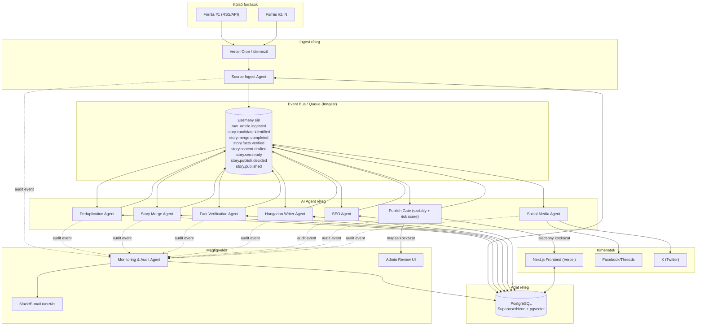

# AI-first Sport News Engine — Architektúra

**Verzió:** 1.0
**Dátum:** 2026-07-27
**Előzmény:** [`docs/feasibility-analysis.md`](../feasibility-analysis.md)

Ez a dokumentumsorozat a magyarsportonline.hu **Story-alapú, event-driven, AI Agent-vezérelt** sporthír-motorjának teljes rendszertervét írja le. A hagyományos "CMS + cikk" modell helyett **esemény- (Story-) központú** adatmodellt és architektúrát használunk: egy valós sportesemény (mérkőzés, transzfer, sérülés, döntés) **egyetlen, folyamatosan frissülő Story-ként** létezik a rendszerben, amelyhez tetszőleges számú forrás és tetszőleges számú verzió tartozhat.

## Dokumentumtérkép

| Dokumentum | Tartalom |
|---|---|
| [01-data-model.md](./01-data-model.md) | Story-alapú adatmodell, ER diagram, állapotgép |
| [02-agents.md](./02-agents.md) | A 8 AI Agent részletes specifikációja, Confidence Score és Risk Gate logika |
| [03-event-flow.md](./03-event-flow.md) | Event-driven kommunikációs folyamat, event katalógus, üzenet-sémák |
| [04-api-spec.md](./04-api-spec.md) | API specifikáció (publikus, admin, belső agent-API) |
| [05-repo-structure.md](./05-repo-structure.md) | GitHub monorepo struktúra |
| [06-deployment.md](./06-deployment.md) | Vercel deployment terv, környezetek, CI/CD |
| [07-scalability.md](./07-scalability.md) | Skálázhatósági terv (1 forrástól 300+ forrásig) |
| [08-roadmap.md](./08-roadmap.md) | 100 lépéses fejlesztési roadmap |

## Alapelvek

1. **Story, nem cikk.** A rendszer nem "cikkeket" tárol, hanem **eseményeket (Story)**. Egy Story-hoz N darab forrás (`RawArticle`) és N darab verzió (`StoryVersion`) tartozik. Új infó → új verzió, **nem** új cikk.
2. **Minden agent egy tiszta függvény egy eseményre.** Bemenet: esemény (queue message) + adatbázis-állapot. Kimenet: adatbázis-írás + új esemény(ek). Nincs megosztott mutable state agentek között — minden kommunikáció a queue-n és az adatbázison keresztül történik.
3. **Semmilyen agent nem publikál közvetlenül.** A publikálás egy explicit **Publish Gate** döntés (confidence score + risk level alapján), amit a rendszer hoz meg szabály + AI kombinációval — ez különíti el "mit írt az AI" és "mi ment ki élesben" felelősségét.
4. **Minden Story-nak van bizalmi pontszáma, forráslistája, verziótörténete és auditnaplója** — nincs "néma" mutáció, minden változás visszakövethető.
5. **Event-driven, queue-alapú.** Az agentek nem hívják egymást közvetlenül (nincs pont-pont HTTP lánc) — mindegyik egy esemény-buszon (queue) keresztül kommunikál, ami lehetővé teszi a független skálázást, retry-t és megfigyelhetőséget.

## Rendszerarchitektúra — magas szintű áttekintés

**Kulcs döntés:** az agentek **nem** szinkron RPC-lánccal hívják egymást, hanem egy **eseménysínen** (queue/event bus) keresztül reagálnak egymás kimenetére. Ez azt jelenti, hogy bármelyik agent önállóan skálázható, hibatűrő (retry/dead-letter), és a folyamat bármely pontján megfigyelhető anélkül, hogy a többi agentet érintené.

A queue/event bus technológiai választását és indoklását lásd: [03-event-flow.md](./03-event-flow.md).
